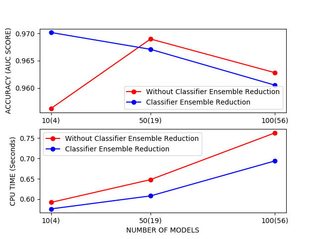

# Feature Selection Inspired Classifier Ensemble Reduction

Harmony Search
-----------------------------------------------
In operations research, harmony search is a phenomenon-mimicking metaheuristic introduced in 2001 by Zong Woo Geem, Joong Hoon Kim, and G. V. Loganathan.[1] Harmony search is inspired by the improvisation process of jazz musicians.

# Installation

*Dependecies*

* functools.
* numpy.
* sklearn.
* joblib [github link](https://github.com/joblib/joblib).
* pandas

# Base Models

* Linear Regression.
* Random Forest Classifier.
* Decision Tree.
* Logistic Regression.

# Ensemble Models

* Blending.
* Stacking.

# Key Features

* Training/Testing automation.
* Recursive harmony search.

# Note

* When testing on different datasets, ensure to pass the data correctly. The default dataset used is the bank dataset.

# Results

* Base Classifiers: Decision Trees, Logistic Regression, Linear Regression, Random Forest
* Ensemble Classifier: Stacking (Logistic Regression)
* Evaluation Metric: roc auc score
* Number of Initial Matrices: 10
* Harmony Memory Size: 5
* Harmony Memory Considering Rate: 0.7
* Pitch Adjustment Rate: 0.4

* Bank Dataset (41189 instances, 21 features)

* Magic Dataset (19021 instances, 11 features)

* Heart Dataset (270 instances, 14 features)

* Ionosphere Dataset (351 instances, 35 features)

